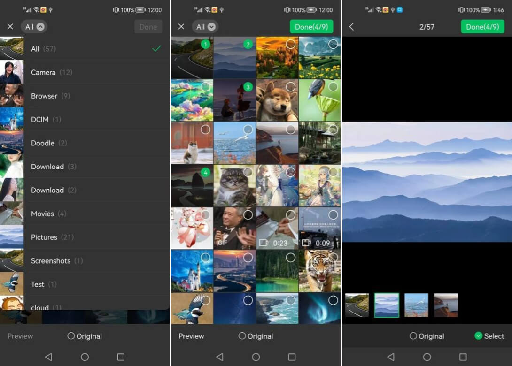

# EasyAlbum
[](https://search.maven.org/artifact/io.github.billywei01/easyalbum)｜[中文文档](README_CN.md)

EasyAlbum is an easy to use media image and video selector for Android.

## 1. Feature

- Support preview；
- Support custom folder sorting；
- Support custom filter；
- Support single selection and multiple selection；
- Support showing selecting order；
- Provider 'original' option；
- Support pass selected medias to reopen album；
- Support auto refresh when album activity resuming；
- Caching media data, be fast to reopen album；
- Support preload to speed up the first time of opening album.



## 2. Getting start
### 2.1 Download

```gradle
implementation 'io.github.billywei01:easyalbum:1.0.6'
```

### 2.2 Global Config

```kotlin
EasyAlbum.config()
    .setImageLoader(GlideImageLoader)
    .setDefaultFolderComparator { o1, o2 -> o1.name.compareTo(o2.name)}
    .setItemAnimator(DefaultItemAnimator())
```

Except for ImageLoader, which must be set, other configurations are optional.

### 2.3 Start Album

```kotlin
EasyAlbum.from(this)
    .setFilter(TestMediaFilter(option))
    .setSelectedLimit(selectLimit)
    .setOverLimitCallback(overLimitCallback)
    .setSelectedList(mediaAdapter?.getData())
    .setAllString(option.text)
    .enableOriginal()
    .start { result ->
        mediaAdapter?.setData(result.selectedList)
    }
```

EasyAlbum starts the album with "from" and ends with "start".

## License
See the [LICENSE](LICENSE) file for license rights and limitations.
